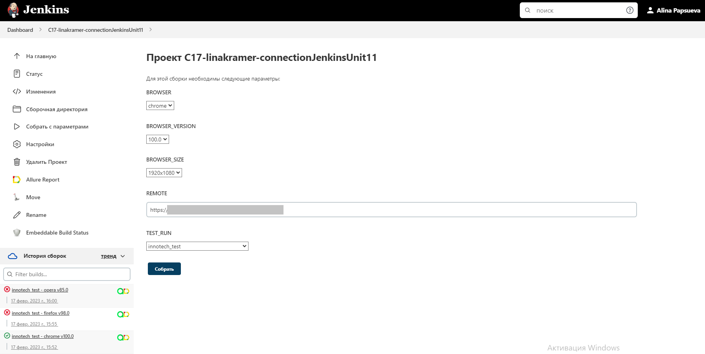

# Демо автоматизации UI-тестов для сайта [ГК "Иннотех"](https://inno.tech/ru/)


## :bookmark_tabs: <a id="list"></a> Содержание 

* <a href="#tools">Технологии и инструменты</a>

* <a href="#cases">Реализованные проверки</a>

* <a href="#integrations">Подключенные интеграции</a>

* <a href="#console">Запуск из терминала</a>

* <a href="#jenkins">Сборка в Jenkins</a>

* <a href="#allure">Allure отчеты</a>

* <a href="#telegram">Отчёт в Telegram</a>

* <a href="#testops">Интеграция с Allure TestOps</a>

* <a href="#jira">Интеграция с Jira</a>

* <a href="#video">Пример прогона теста в Selenoid</a>


## :hammer_and_wrench: <a id="tools"></a> Технологии и инструменты
<p align="center">
<a href="https://www.jetbrains.com/idea/"></a>
<a href="https://www.java.com/"></a>
<a href="https://github.com/"></a>
<a href="https://junit.org/junit5/"></a>
<a href="https://gradle.org/"></a>
<a href="https://selenide.org/"></a>
<a href="https://aerokube.com/selenoid/"></a>
<a href="https://github.com/allure-framework/allure2"></a>
<a href="https://qameta.io)"></a>
<a href="https://www.jenkins.io/"></a>
<a href="https://telegram.org/"></a>
<a href="https://www.atlassian.com/ru/software/jira"></a>
</p>


## :white_check_mark: <a id="cases"></a> Реализованные проверки
:heavy_check_mark: Проверка основных элементов на главной странице   
:heavy_check_mark: Проверка перехода в Личный кабинет без vpn   
:heavy_check_mark: Проверка перехода на страницу Карьера   
:heavy_check_mark: Проверка работы фильтра вакансий - есть хотя бы 1 вакансия   
:heavy_check_mark: Проверка работы фильтра вакансий - вакансий не найдено   

<a href="#list">К Содержанию</a>

## :on:	<a id="integrations"></a> Подключенные интеграции
:heavy_check_mark: Запуск автотестов в Jenkins   
:heavy_check_mark: Allure Report + SelenideLogger.addListener + step()   
:heavy_check_mark: Уведомление от бота в Telegram с отчетом о прохождении тестов   
:heavy_check_mark: Allure TestOps   
:heavy_check_mark: Jira   
:heavy_check_mark: Selenoid   

<a href="#list">К Содержанию</a>

## :desktop_computer: <a id="console"></a> Запуск из терминала
### Локальный запуск тестов

```
gradle clean innotech_test 
```

### Удаленный запуск тестов

```
gradle clean innotech_test
"-Dbrowser=${BROWSER}"
"-DbrowserVersion=${BROWSER_VERSION}"
"-DbrowserSize=${BROWSER_SIZE}"
"-Dremote=${REMOTE}"
```

> `${BROWSER}` - наименование браузера (_по умолчанию - <code>chrome</code>_).
>
> `${BROWSER_VERSION}` - версия браузера (_по умолчанию - <code>100.0</code>_).
>
> `${BROWSER_SIZE}` - размер окна браузера (_по умолчанию - <code>1920x1080</code>_).
>
> `${REMOTE_URL}` - адрес удаленного сервера, на котором будут запускаться тесты.

<a href="#list">К Содержанию</a>

## <a id="jenkins"></a>  Сборка в Jenkins

:information_source: При сборке в Jenkins можно выбрать параметры из выпадающих списков   



<a href="#list">К Содержанию</a>

## <a id="allure"></a>  Allure отчеты

:information_source: По итогам сборки в Jenkins собирается отчет в Allure Report   
* Автотесты написаны как "шаги" через SelenideLogger.addListener + step() = описание пройденных тестов понятно любому сотруднику
* Подключено добавление в отчет:   
  - последнего скриншота
  - ресурсов страницы
  - логов браузера
  - видео прохождения тестов


<a href="#list">К Содержанию</a>

## <a id="telegram"></a>  Отчёт в Telegram


<a href="#list">К Содержанию</a>

## <a id="testops">  Интеграция с Allure TestOps


<a href="#list">К Содержанию</a>

## <a id="jira"></a>  Интеграция с Jira


<a href="#list">К Содержанию</a>

## <a id="video"></a>  Пример прогона теста в Selenoid


<a href="#list">К Содержанию</a>
